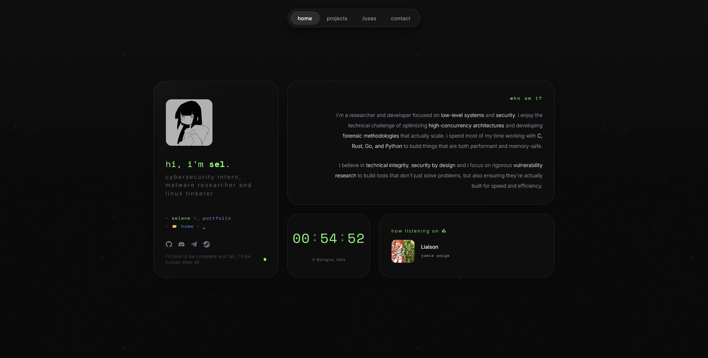
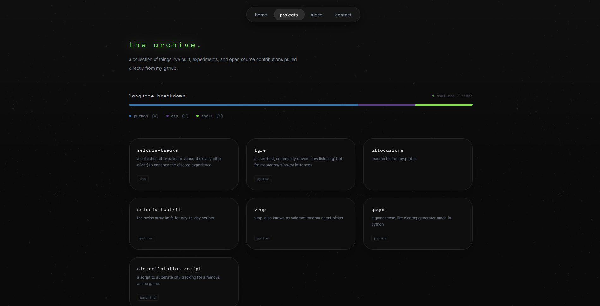
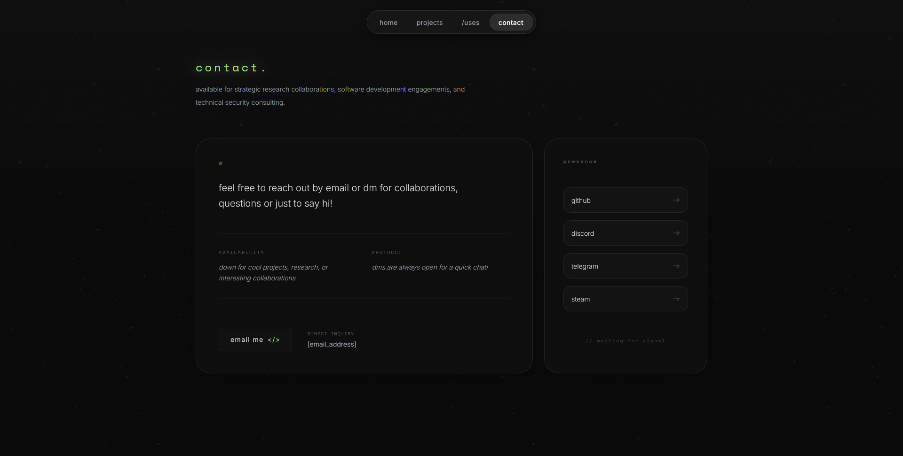
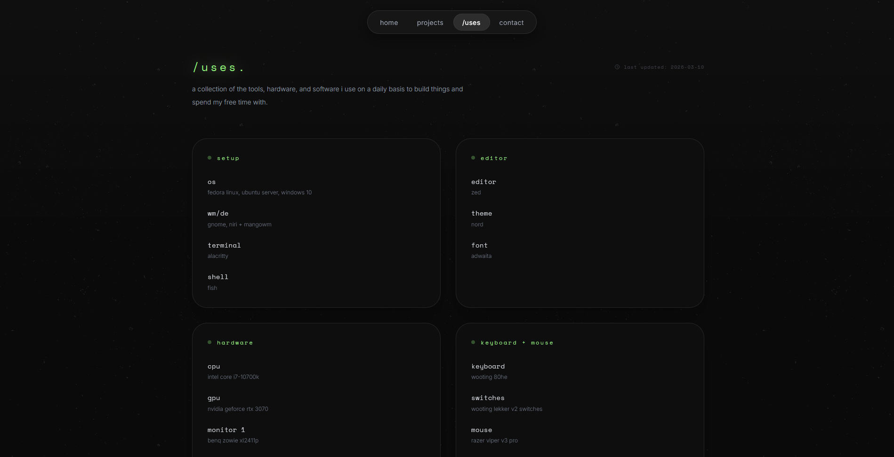

# Portfolio / @seleneftw

Docs for the allocazione.dev website. Built using Svelte 5 and SvelteKit + TailwindCSS, focused on high-performance static delivery and modular architecture.

## Screenshots

<details>
<summary>Home Page</summary>

</details>

<details>
<summary>Projects Archive</summary>

</details>

<details>
<summary>Contact Hub</summary>

</details>

<details>
<summary>Uses Template</summary>

</details>

## Technical Specification

| Layer | Technology |
|---|---|
| Runtime | Node.js |
| Framework | Svelte 5 (Runes) |
| Meta-framework | SvelteKit 2 (SSG) |
| Styling | Tailwind CSS 4 |
| Localization | svelte-i18n |
| Distribution | GitHub Pages / Cloudflare Pages |

## Project Structure

```text
src/
├── lib/
│   ├── actions/          # DOM-level interaction modules ( tooltip )
│   ├── components/       
│   │   ├── ui/           # Atomic UI elements (Button, Nav, Ticker)
│   │   └── widgets/      # Integrated feature modules (Clock, StatsFM)
│   ├── locales/          # I18n logic and data
│   │   ├── data/         # Translation JSON schemas
│   │   └── i18n.js       # Locale registration and store initialization
│   └── config.js         # Site-wide data configuration
├── routes/               # File-based routing system
└── app.css               # Global styling and tailwind design tokens
```

## Core Systems

### Internationalization (I18n)
Managed via `src/lib/locales/i18n.js`. Locales are dynamically imported in chunks to minimize initial bundle size. Translations are accessed via the `$t` store in Svelte components.

### Accent Serialization
Enforced through SvelteKit hooks (`src/hooks.server.js`). The system reads the `accent_color` cookie and injects the corresponding CSS variables into the HTML head during SSR/Prerendering to prevent "Flash of Unstyled Content" (FOUC).

### Data Integration
The projects archive fetches repository data from the GitHub REST API. It includes an in-memory caching layer to optimize build times and respect API rate limits. Musical activity is integrated via the Stats.fm API.

## Configuration Reference

The `src/lib/config.js` file serves as the singular source of truth for the application.

| Property | Type | Description |
|---|---|---|
| `name` | String | Used in page titles and greetings. |
| `profession` | String | Professional title shown in the bio section. |
| `socials` | Array<Object> | Map of social platforms and target URLs. |
| `descriptions` | Array<String> | Used for randomized meta descriptions and about text. |
| `statsFmUser` | String | Target username for music integration. |
| `lastUpdated` | String | ISO formatted date for site update status. |

## Deployment and Workflow

### Installation
```bash
npm install
```

### Development environment
```bash
npm run dev
```

### Production build
```bash
npm run build
```

---

// a simple silhouette of breakbeats bent <3
